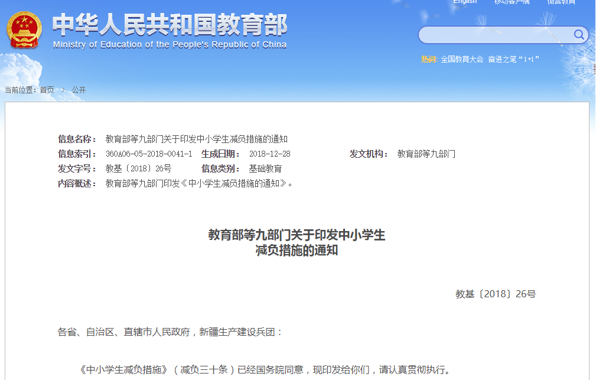
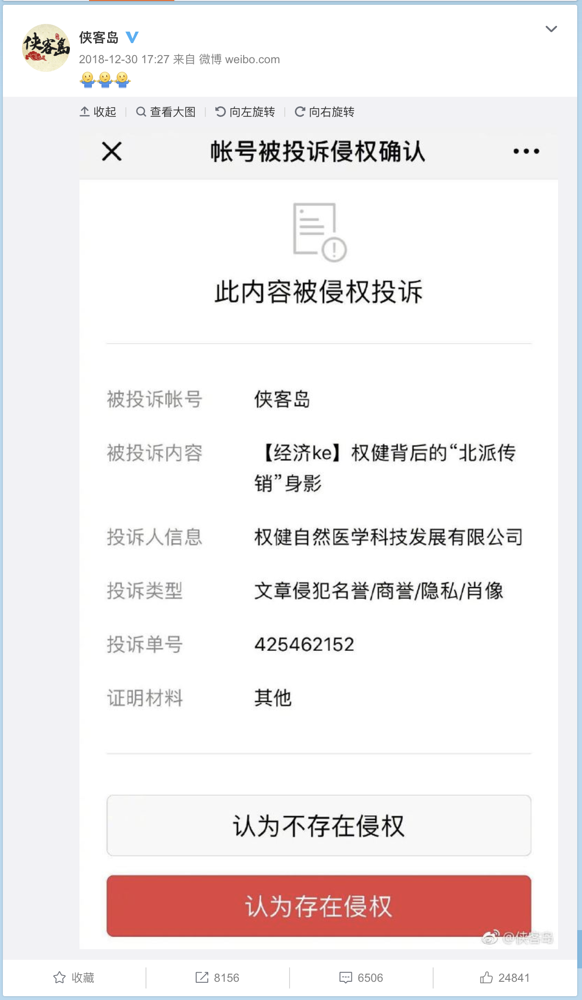

2018
====

# 税改引发房租涨价大讨论

+ 时间

    约 12 月中旬开始
    
+ 来源

    网络讨论

# 教育部发布《中小学生减负措施》（减负三十条）

+ 时间

    2018-12-29

+ 来源

    中华人民共和国教育部

    [http://www.moe.gov.cn/srcsite/A06/s3321/201812/t20181229_365360.html](http://www.moe.gov.cn/srcsite/A06/s3321/201812/t20181229_365360.html)

    联合早报
    
    [http://m.unzbw.com/shiju/20181230/52899.html](http://m.unzbw.com/shiju/20181230/52899.html)

+ 截图

    

# 权健怒怼侠客岛

+ 时间

    2018-12-30 (“侠客岛” 发出微博时间)
    
+ 来源

    “侠客岛” 官方微博
    
    [https://weibo.com/5476386628/H9DNmhK8J](https://weibo.com/5476386628/H9DNmhK8J)
    
+ 截图

    
    
+ 相关阅读
    
    紫光阁大饭店 __TODO__

+ 前情提要

    权健火疗耽误治疗至女童死亡 __TODO__
    
    其他相关新闻 __TODO__

    丁香医生发文声讨权健伪科学 __TODO__
    
+ 后续

    [\[后续\] 权健公司实际控制人束昱辉等 18 人被依法刑事拘留](../02/README.md#\[后续\]-权健公司实际控制人束昱辉等-18-人被依法刑事拘留)

    [天津足球俱乐部更名](../02/README.md#天津足球俱乐部更名)
