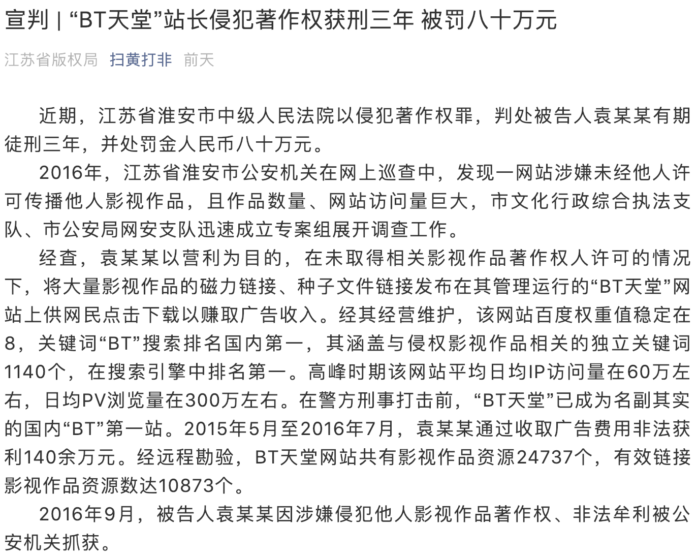
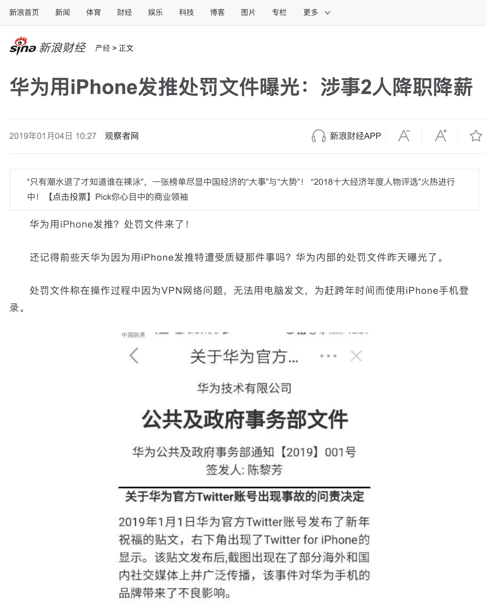
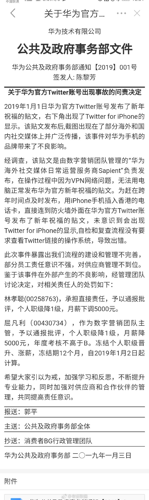
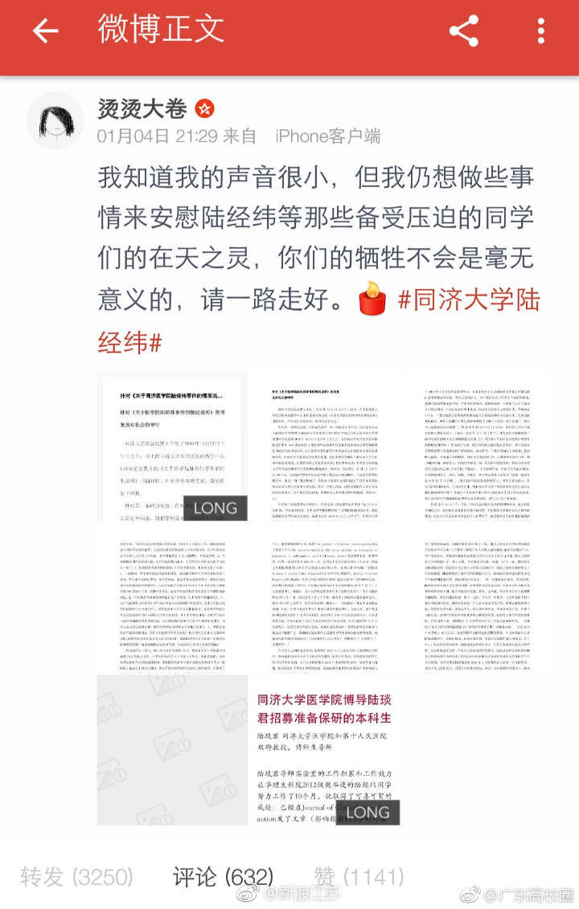
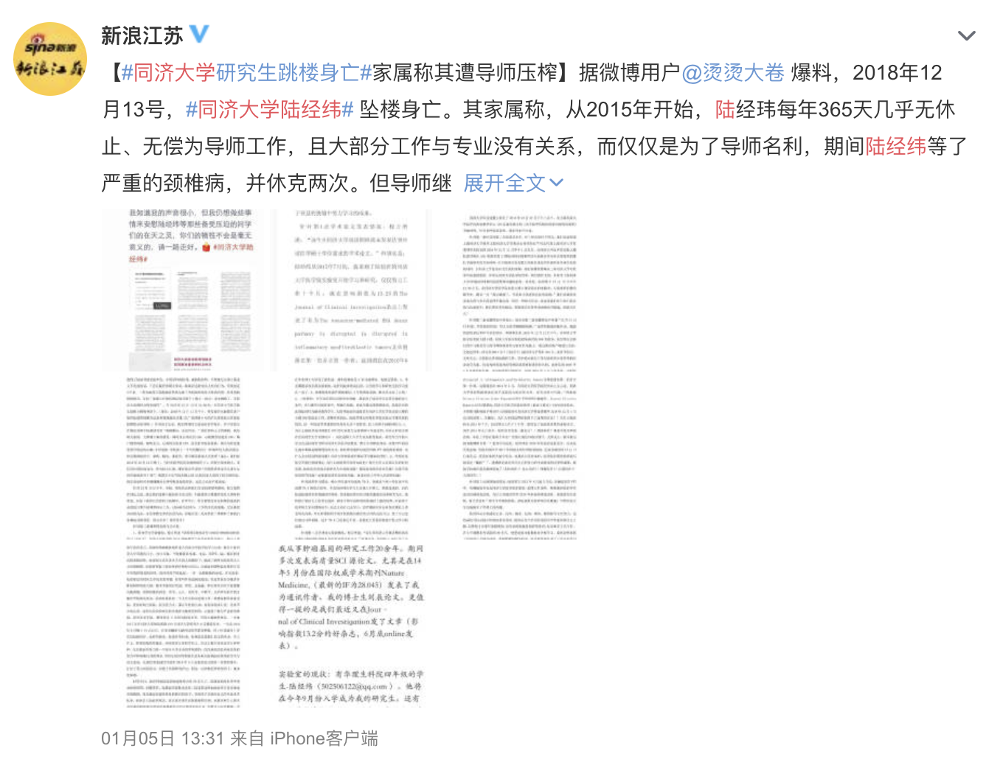
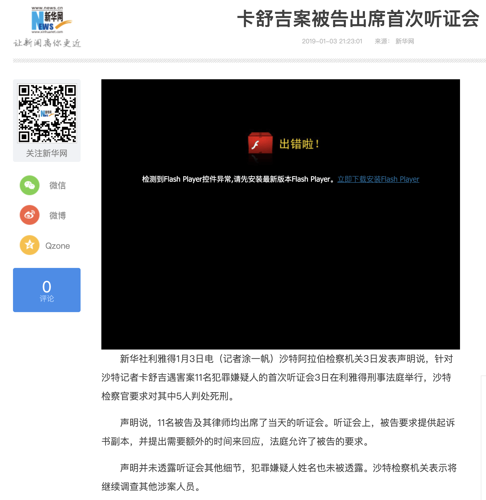

第一周
======

# 个人所得税 APP 短信服务崩溃导致新用户无法注册

+ 时间

    2019-01-01~2019-01-05 (目测)

+ 来源

    网络讨论
    
+ 截图

    

+ 相关阅读

    [税改引发房租涨价大讨论](../00/README.md#税改引发房租涨价大讨论)

# [后续] “BT 天堂”站长侵犯著作权被判三年

+ 时间

    2019-01-02
 
+ 来源

    “扫黄打非” 官方微信公众号
    
    [https://mp.weixin.qq.com/s/SKISbSNbLQ1I5IJ_NfDQpw](https://mp.weixin.qq.com/s/SKISbSNbLQ1I5IJ_NfDQpw)

+ 截图

    

+ 前请提要

    __TODO__

# 《飞碟探索》杂志休刊一年

+ 时间
    
    2019-01-03 (最早新闻事件)
    
+ 来源

    __TODO__
    
+ 截图

    __TODO__

# [后续] 华为处理使用 iPhone 发推当事员工

+ 时间
    
    2019-01-03 (最早截图发布时间)
    
+ 来源

    网络 (未找到最早发布源)

    来源之一：新浪新闻
    
    [https://finance.sina.com.cn/chanjing/gsnews/2019-01-04/doc-ihqhqcis2970952.shtml](https://finance.sina.com.cn/chanjing/gsnews/2019-01-04/doc-ihqhqcis2970952.shtml)

+ 截图

    
    
    

+ 前请提要

    __TODO__

# 同济大学研究生陆经纬遭导师压榨跳楼自杀

+ 时间

    2019-01-04 (微博发声时间)

+ 来源

    微博 (源账号已被封)
    
    官方新闻: 新浪江苏
    
    [https://weibo.com/2259661342/HawOqjXP8](https://weibo.com/2259661342/HawOqjXP8)

+ 截图

    
    
    

+ 相关阅读

    同济大学自杀研究生列表 __TODO__

# [后续] 记者卡舒吉遇害案开庭

+ 时间

    2019-01-04 (新闻时间)
    
+ 来源

    新华网
    
    [http://www.xinhuanet.com/world/2019-01/03/c_1210029802.htm](http://www.xinhuanet.com/world/2019-01/03/c_1210029802.htm)

+ 截图

    
