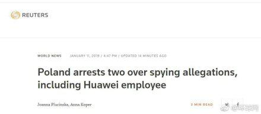

一月
====

# 妻子举报大连海关“科级”丈夫睡 14 名代购, 其中一名是处女

+ 时间

    2019-01-06 (微博文章发布时间)

+ 来源

    微博
    
    [https://www.weibo.com/ttarticle/p/show?id=2309404325189360998090](https://www.weibo.com/ttarticle/p/show?id=2309404325189360998090)

+ 截图

    

+ 官方回应

    __TODO__

# 外交官孙子举报其祖父与父亲

外交官孙子举报祖父与其亲生女儿乱伦、杀人, 父亲乱搞男女关系, 离婚后拒付抚养费

+ 时间

    2019-01-06 (视频传播时间, 上传时间不可考)

+ 来源

    互联网 (来源已被删除)
    
    [https://www.youtube.com/watch?v=CS18-QCP20k](https://www.youtube.com/watch?v=CS18-QCP20k)

+ 视频 (墙内源已被删除)

    [https://www.youtube.com/watch?v=CS18-QCP20k](https://www.youtube.com/watch?v=CS18-QCP20k)

+ 当事人回应

    已报警 __TODO__

# “艺术升” APP 崩溃致 70 万艺考生无法报名

+ 时间

    2019-01-06 (报名时间早上 6:00)
    
+ 来源

    网络讨论, 关键词 “艺术升”
    
+ 截图

    微博热贴

    
    
+ 官方回应

    拉长报名三天 __TODO__

+ 相关阅读

    __99 宿舍网__
    
    李肇星之子李禾禾创办, 曾为大学英语四六级考试唯一成绩查询网站, 目前除主页外其他页面均已无法访问.

# 8 岁幼女被亲爹后妈卖掉后遭买主强奸, 拍 “训练” 视频在群聊中拉客

+ 时间

    2019-01-06 (新闻时间)
    
+ 来源

    搜狐新闻
    
    [http://www.sohu.com/a/287005507_99962416](http://www.sohu.com/a/287005507_99962416)

+ 截图

    

# 没有上班却在个人所得税 APP 中有就职信息

+ 时间

    2019-01-07 (新闻时间)

+ 来源

    央视新闻
    
    [http://m.news.cctv.com/2019/01/07/ARTIn5u8bTy3PAUbTTJwTBec190107.shtml](http://m.news.cctv.com/2019/01/07/ARTIn5u8bTy3PAUbTTJwTBec190107.shtml)

+ 截图

    

# 记者团菲律宾官方旅行团奇遇记

+ 时间

    2019-01-07 (微博文章发布时间)

+ 来源

    微博
    
    [https://weibo.com/1873398564/HaTAKEJvZ?type=comment](https://weibo.com/1873398564/HaTAKEJvZ?type=comment)
    
    文章链接
    
    [https://weibo.com/ttarticle/p/show?id=2309404325969790935091](https://weibo.com/ttarticle/p/show?id=2309404325969790935091)

+ 截图

    

# 射电望远镜接收到疑似外星人信号

+ 时间

    2019-01-07
    
+ 来源

    《自然》杂志 (不会找)
    
    新浪财经
    
    [https://tech.sina.com.cn/d/s/2019-01-11/doc-ihqhqcis5089699.shtml](https://tech.sina.com.cn/d/s/2019-01-11/doc-ihqhqcis5089699.shtml)

+ 截图

    

# [含后续] 江苏金湖145名儿童服过期疫苗

+ 时间

    2019-01-07 (新闻发布时间)

+ 来源

    扬子晚报 (未找到)
    
    新浪财经 (后续《江苏金湖疾控中心领导全部停职》)
    
    [https://finance.sina.com.cn/roll/2019-01-09/doc-ihqhqcis4627600.shtml](https://finance.sina.com.cn/roll/2019-01-09/doc-ihqhqcis4627600.shtml)

+ 截图

    

# 酒井法子在线乞讨

+ 时间

    2019-01-07 (微博发布时间)
    
+ 来源

    微博 (已被删除)

+ 截图

    

+ 当事人回应

    __TODO__

# [后续] 权健公司实际控制人束昱辉等18人被依法刑事拘留

+ 时间

    2019-01-07
    
+ 来源

    津云
    
    [http://www.app.tjyun.com/share/app/ve/app/newswebshare.html?newsId=036625688](http://www.app.tjyun.com/share/app/ve/app/newswebshare.html?newsId=036625688)

+ 截图

    
    
+ 前情提要

    请参阅 [权健怒怼侠客岛](../00/README.md#权健怒怼侠客岛) 有关章节

# 全家便利店被爆售卖过期食品

+ 时间

    2019-01-08 (微博发布时间)
    
+ 来源

    蓝莓评测官方微博
    
    [https://weibo.com/5923873454/HaWG2y2Pr](https://weibo.com/5923873454/HaWG2y2Pr)
    
+ 截图

    

+ 官方回应

    __TODO__
    
# 北京宣武师范学校附属第一小学发生袭击事件, 20 名儿童受伤

+ 时间
  
    2019-01-08 (事发时间)
    
+ 来源

    不详 (内网已删除)
    
    纽约时报中文网
    
    [https://cn.nytimes.com/china/20190108/man-attacks-chinese-elementary-students-in-beijing-injuring-20/](https://cn.nytimes.com/china/20190108/man-attacks-chinese-elementary-students-in-beijing-injuring-20/)
    
+ 截图

    
    
+ 后续处理

    __TODO__
    
# [后续] 张扣扣案一审判决死刑, 当庭表示上诉

+ 时间

    2019-01-08
    
+ 来源

    新京报
    
    [https://m.bjnews.com.cn/detail/154694071914263.html](https://m.bjnews.com.cn/detail/154694071914263.html)
    
+ 截图

    

+ 前情提要

    __TODO__

# 亚马逊创始人贝索斯离婚

+ 时间

    2019-01-09 (推特发布时间)
    
+ 来源

    推特
    
    [https://twitter.com/JeffBezos/status/1083004911380393985](https://twitter.com/JeffBezos/status/1083004911380393985)
    
+ 截图

    

# 短视频审核划定100条红线：宣扬颓废人生观等内容不得出现

+ 时间

    2019-01-09 (发布时间)

+ 来源

    中国网络视听节目服务协会官网
    
    [http://www.cnsa.cn/index.php/infomation/dynamic_details/id/69/type/2.html](http://www.cnsa.cn/index.php/infomation/dynamic_details/id/69/type/2.html)

+ 截图

    

# 韩速滑女王起诉前教练姓侵

+ 时间

    2019-01-09 (新闻时间)
    
+ 来源

    韩联社 (不会韩语)
    
    网易新闻链接
    
    [http://sports.163.com/19/0109/09/E52PC63T00058782.html](http://sports.163.com/19/0109/09/E52PC63T00058782.html)
    
+ 截图

    

# 网信办发布《区块链信息服务管理规定》

+ 时间

    2019-01-10
    
+ 来源

    网信办官网
    
    [http://www.cac.gov.cn/2019-01/10/c_1123971164.htm](http://www.cac.gov.cn/2019-01/10/c_1123971164.htm)
    
+ 截图

    

# 上海凤凰子公司与ofo达成和解：剩余货款同意对方分期支付

+ 时间

    2019-01-10
    
+ 来源

    每日经济新闻
    
    [http://www.nbd.com.cn/articles/2019-01-10/1289982.html](http://www.nbd.com.cn/articles/2019-01-10/1289982.html)

+ 截图

    

# 波兰逮捕1名疑似华为员工 被指控从事间谍活动

+ 时间

    2019-01-10 (网易新闻时间)

+ 来源

    波兰国家通讯社PAP (不会查)
    
    网易新闻
    
    [http://news.163.com/19/0111/18/E58QJCO80001899O.html](http://news.163.com/19/0111/18/E58QJCO80001899O.html)
    
+ 截图

    

    
    
+ 后续

    [\[后续\] 华为回应波兰员工事件：终止雇佣关系](./README.md#%5B后续%5D%20华为回应波兰员工事件：终止雇佣关系)

# [后续] 华为回应波兰员工事件：终止雇佣关系

员工姓名：王伟晶

+ 时间

    2019-01-13 (新闻时间)
    
+ 来源

    通信世界网
    
    [http://www.cww.net.cn/article?id=445573](http://www.cww.net.cn/article?id=445573)
    
+ 截图

    
    
+ 前情提要

    [波兰逮捕1名疑似华为员工 被指控从事间谍活动](./README.md#波兰逮捕1名疑似华为员工%20被指控从事间谍活动)

# 台故宫博物院《祭侄文稿》出借日本展出

+ 时间

    早有约定, 于 1 月第二周被翻出, 讨论
    
    出借时间:
    
    将于 1 月 16 日出借
    
+ 来源

    网络讨论
    
    搜狐新闻
    
    [http://www.sohu.com/a/244057598_163947](http://www.sohu.com/a/244057598_163947)

+ 截图

    
    
    
