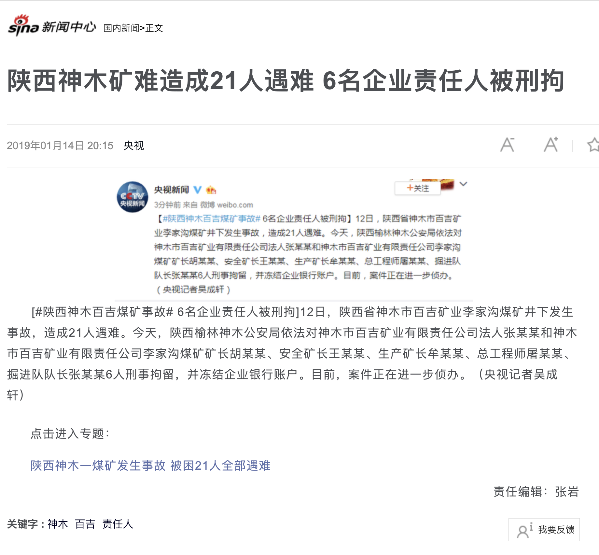
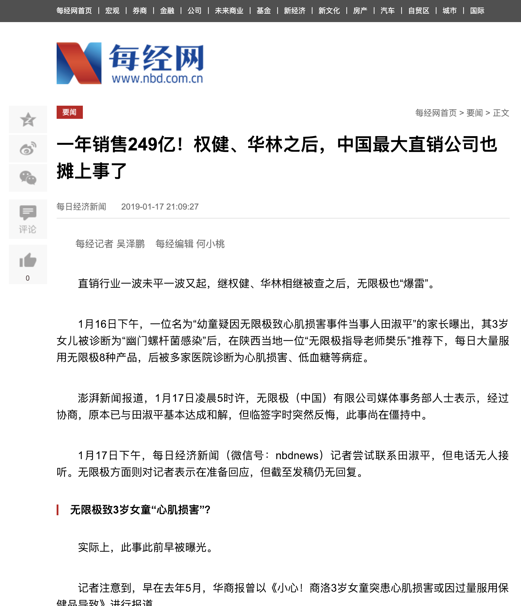
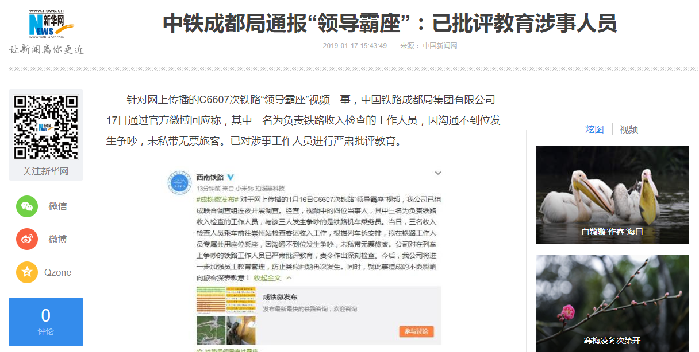
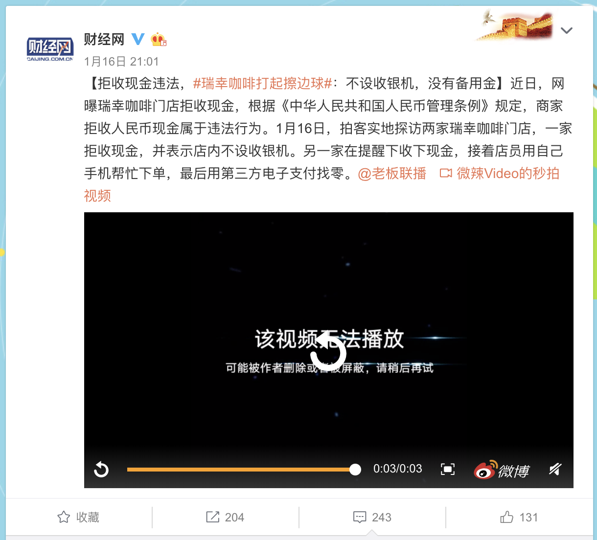
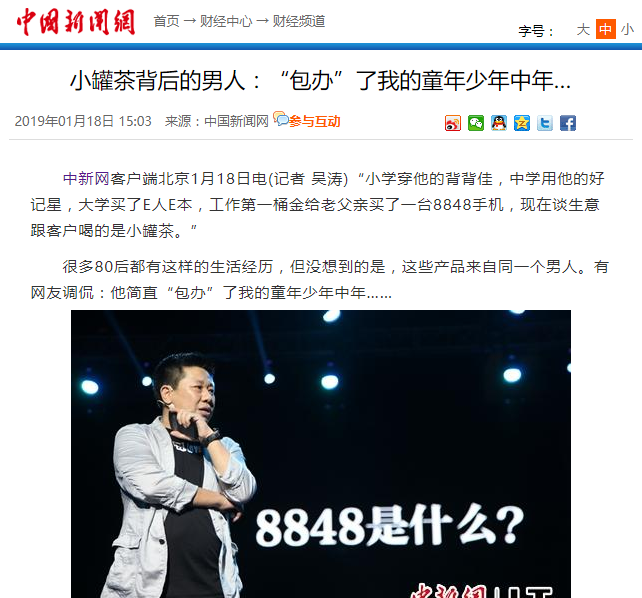
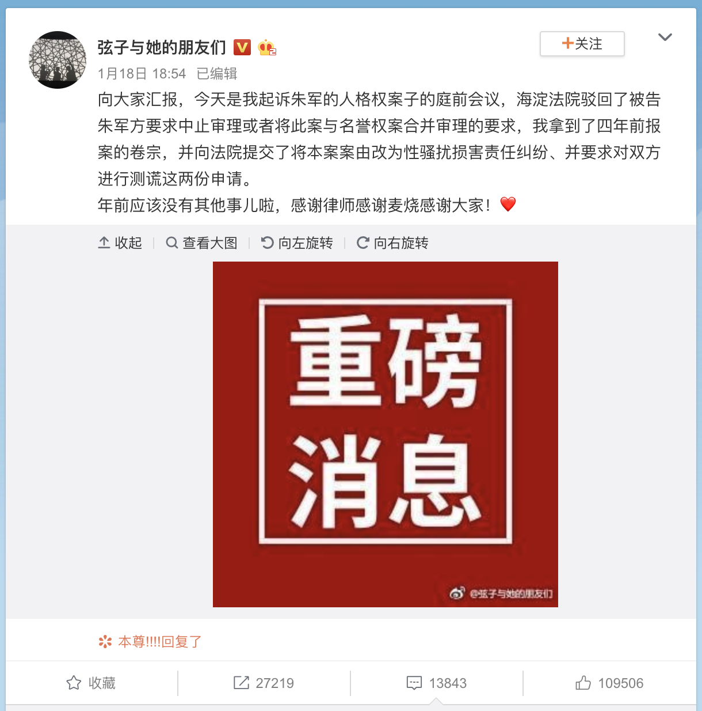

第三周
===

# [后续] 陕西神木煤矿事故：被困21名工人已全部遇难

+ 时间

    2019-01-13 (新闻时间)

+ 来源

    新闻

    新浪新闻
    
    [http://news.sina.com.cn/o/2019-01-13/doc-ihqfskcn6629776.shtml](http://news.sina.com.cn/o/2019-01-13/doc-ihqfskcn6629776.shtml)

+ 截图

    

+ 前情提要

    [陕西煤矿事故约 20 人被困](../02/README.md#陕西煤矿事故约-20-人被困)

+ 后续

    [\[后续\] 陕西神木矿难造成21人遇难 6名企业责任人被刑拘](../03/README.md#后续-陕西神木矿难造成21人遇难-6名企业责任人被刑拘)    

# [后续] 华为回应波兰员工事件：终止雇佣关系

员工姓名：王伟晶

+ 时间

    2019-01-13 (新闻时间)
    
+ 来源

    通信世界网
    
    [http://www.cww.net.cn/article?id=445573](http://www.cww.net.cn/article?id=445573)
    
+ 截图

    
    
+ 前情提要

    [波兰逮捕1名疑似华为员工 被指控从事间谍活动](../02/README.md#波兰逮捕1名疑似华为员工-被指控从事间谍活动)

# 加拿大籍被告人罗伯特·劳埃德·谢伦伯格因犯走私毒品罪被依法判处死刑

+ 时间

    2019-01-14

+ 来源

    新华网
    
    [http://www.xinhuanet.com/legal/2019-01/14/c_1123989369.htm](http://www.xinhuanet.com/legal/2019-01/14/c_1123989369.htm)

+ 截图

    

# 甘肃 8 岁女孩受伤事件

    直接导火索：同学借橡皮 & 女老师口红丢失

+ 时间

    2019-01-14 (新闻时间)
    
+ 来源

    原始来源丢失
    
    新浪新闻
    
    [https://news.sina.com.cn/o/2019-01-14/detail-ihqhqcis5985113.d.html](https://news.sina.com.cn/o/2019-01-14/detail-ihqhqcis5985113.d.html)
    
+ 截图

    

+ 后续

    [甘肃 8 岁女孩受伤事件丢口红老师接受警方询问](#甘肃-8-岁女孩受伤事件丢口红老师接受警方询问)

# [后续] 陕西神木矿难造成21人遇难 6名企业责任人被刑拘

+ 时间

    2019-01-14 (新闻时间)
    
+ 来源

    新闻
    
    新浪新闻
    
    [https://news.sina.com.cn/o/2019-01-14/detail-ihqfskcn7095838.d.html](https://news.sina.com.cn/o/2019-01-14/detail-ihqfskcn7095838.d.html)
    
+ 截图

    

+ 前情提要

    [陕西煤矿事故约 20 人被困](../02/README.md#陕西煤矿事故约-20-人被困)
    
    [\[后续\] 陕西神木煤矿事故：被困21名工人已全部遇难](../03/README.md#后续-陕西神木煤矿事故：被困21名工人已全部遇难)

# 河北华林公司涉组织领导传销 主要负责人被警方控制

+ 时间

    2019-01-16 (新闻时间)
    
+ 来源

    新华社石家庄
    
    [http://www.xinhuanet.com/legal/2019-01/16/c_1123997375.htm](http://www.xinhuanet.com/legal/2019-01/16/c_1123997375.htm)
    
+ 截图

    
    
+ 相关阅读

    权健事件 __TODO__
    
    [幼童疑因无限极致心肌损害事件](#幼童疑因无限极致心肌损害事件)

# 成都领导霸座

    车次: C6607

+ 时间

    2019-01-16

+ 来源

    新浪微博
    
    [https://weibo.com/1618051664/Hcl2u5ccL](https://weibo.com/1618051664/Hcl2u5ccL)
    
+ 截图

    

+ 后续

    [中铁成都局通报“领导霸座”：已批评教育涉事人员](#中铁成都局通报“领导霸座”：已批评教育涉事人员)

# 幼童疑因无限极致心肌损害事件

+ 时间

    2019-01-16 (新闻报道时间)

+ 来源

    新浪微博: 田淑平21
    
    [https://weibo.com/u/6859268756](https://weibo.com/u/6859268756)
 
    每日经济新闻
    
    [http://www.nbd.com.cn/articles/2019-01-17/1292496.html](http://www.nbd.com.cn/articles/2019-01-17/1292496.html)

+ 截图

    
    
    

+ 相关阅读

    权健事件 __TODO__
    
    [河北华林公司涉组织领导传销 主要负责人被警方控制](#河北华林公司涉组织领导传销-主要负责人被警方控制)

# 中铁成都局通报“领导霸座”：已批评教育涉事人员

+ 时间

    2019-01-17
    
+ 来源

    中国新闻网
    
    新华网
    
    [http://www.xinhuanet.com/politics/2019-01/17/c_1124004221.htm](http://www.xinhuanet.com/politics/2019-01/17/c_1124004221.htm)
    
+ 截图

    
    
+ 前情提要

    [成都领导霸座](#成都领导霸座)

# 山西公布“国贫县贫困户有奔驰奥迪”调查结果

+ 时间

    2019-01-17 
    
+ 来源

    新华网
    
    [http://www.xinhuanet.com/local/2019-01/17/c_1124002537.htm](http://www.xinhuanet.com/local/2019-01/17/c_1124002537.htm)
    
+ 截图

    

+ 前情提要

    [贫困户被曝有奔驰奥迪](../02/README.md#贫困户被曝有奔驰奥迪)

# 瑞幸咖啡拒收现金

+ 时间

    2019-01-17 (微博时间)
    
+ 来源

    网络
    
    财经网新浪微博
    
    [https://www.weibo.com/1642088277/HcfsypIvi](https://www.weibo.com/1642088277/HcfsypIvi)
    
+ 截图

    
    
# 甘肃 8 岁女孩受伤事件丢口红老师接受警方询问

+ 时间

    2019-01-17 (新闻时间)
    
+ 来源

    最初来源丢失
    
    [https://news.sina.com.cn/o/2019-01-17/doc-ihqfskcn8048764.shtml](https://news.sina.com.cn/o/2019-01-17/doc-ihqfskcn8048764.shtml)
    
+ 截图

    
    
+ 前情提要

    [甘肃 8 岁女孩受伤事件](#甘肃-8-岁女孩受伤事件)

# 起底“小罐茶”背后的男人

+ 时间

    2019-01-18 (热点开始时间)
    
+ 来源

    网络
    
    中国新闻网
    
    [http://www.chinanews.com/cj/2019/01-18/8732850.shtml](http://www.chinanews.com/cj/2019/01-18/8732850.shtml)

+ 截图

    

# 朱军性侵案庭前会议

+ 时间

    2019-01-18 (微博发布时间)
    
+ 来源

    微博：弦子与她的朋友们
    
    [https://weibo.com/6640656158/Hcxu0Dvkt](https://weibo.com/6640656158/Hcxu0Dvkt)
    
+ 截图

    

+ 前情提要

    朱军性侵案 __TODO__
