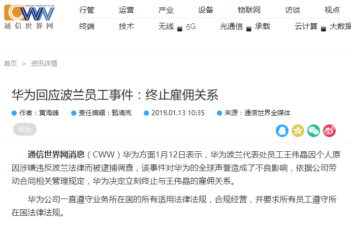

第三周
===

# [后续] 陕西神木煤矿事故：被困21名工人已全部遇难

+ 时间

    2019-01-13 (新闻时间)

+ 来源

    新闻

    新浪新闻
    
    [http://news.sina.com.cn/o/2019-01-13/doc-ihqfskcn6629776.shtml](http://news.sina.com.cn/o/2019-01-13/doc-ihqfskcn6629776.shtml)

+ 截图

    

+ 前情提要

    [陕西煤矿事故约 20 人被困](../02/README.md#陕西煤矿事故约-20-人被困)

+ 后续

    [\[后续\] 陕西神木矿难造成21人遇难 6名企业责任人被刑拘](../03/README.md#后续-陕西神木矿难造成21人遇难-6名企业责任人被刑拘)    

# [后续] 华为回应波兰员工事件：终止雇佣关系

员工姓名：王伟晶

+ 时间

    2019-01-13 (新闻时间)
    
+ 来源

    通信世界网
    
    [http://www.cww.net.cn/article?id=445573](http://www.cww.net.cn/article?id=445573)
    
+ 截图

    
    
+ 前情提要

    [波兰逮捕1名疑似华为员工 被指控从事间谍活动](../02/README.md#波兰逮捕1名疑似华为员工-被指控从事间谍活动)

# [后续] 陕西神木矿难造成21人遇难 6名企业责任人被刑拘

+ 时间

    2019-01-14 (新闻时间)
    
+ 来源

    新闻
    
    新浪新闻
    
    [https://news.sina.com.cn/o/2019-01-14/detail-ihqfskcn7095838.d.html](https://news.sina.com.cn/o/2019-01-14/detail-ihqfskcn7095838.d.html)
    
+ 截图

    

+ 前情提要

    [陕西煤矿事故约 20 人被困](../02/README.md#陕西煤矿事故约-20-人被困)
    [\[后续\] 陕西神木煤矿事故：被困21名工人已全部遇难](../03/README.md#后续-陕西神木煤矿事故：被困21名工人已全部遇难)
