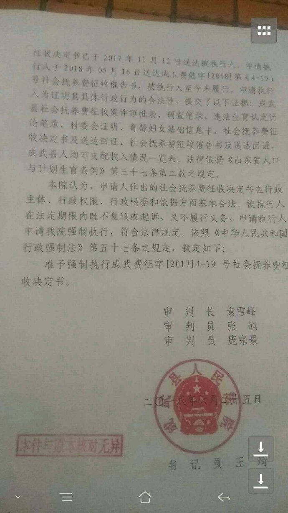

第五周 (02-03 ~ 02-09)
======

# [后续] 石家庄疫苗调包事件官方通报

+ 时间

    2019-02-03
    
+ 来源

    石家庄市桥西区人民政府
    
    [http://www.sjzqx.gov.cn/view.jsp?newsid=154917883571044074](http://www.sjzqx.gov.cn/view.jsp?newsid=154917883571044074)
    
+ 截图

    
    
+ 前情提要

    [石家庄市桥西区汇通社区卫生服务中心疫苗错种事件](../05/README.md#石家庄市桥西区汇通社区卫生服务中心疫苗错种事件)

    [\[后续\] 桥西区疾病预防控制中心发布《关于汇通社区卫生服务中心误种疫苗的情况说明》](../05/README.md#后续-桥西区疾病预防控制中心发布《关于汇通社区卫生服务中心误种疫苗的情况说明》)

    [\[后续\] 石家庄疫苗调包事件官方通报](../05/README.md#后续-石家庄疫苗调包事件官方通报)

# 亚布力度假村诺如病毒感染事件

+ 时间

    2019-02-04（微博说明事件发生时间）
    
+ 来源

    网络
    
    观察者网
    
    [https://www.guancha.cn/politics/2019_02_12_489817.shtml](https://www.guancha.cn/politics/2019_02_12_489817.shtml)
    
+ 截图

    

# 上海新兴静注人免疫球蛋白艾滋病抗体呈阳性

+ 时间

    2019-02-05
    
+ 来源

    网络
    
    华夏时报
    
    [http://www.chinatimes.net.cn/article/83913.html](http://www.chinatimes.net.cn/article/83913.html)

+ 截图

    
    
    
    
    
    
    

+ 后续

    [\[后续\] 上海新兴医药全面停产](../07/README.md#后续-上海新兴医药全面停产)

# 《流浪地球》上映

    相关讨论实在太多了，太小的事情就不说了，没必要一个一个拎出来
    
    额外说一句，大纪元的 SEO 做的真狠，谷歌出来的新闻前两条都是它写的
    
+ 时间

    2019-02-05
    
+ 来源

    豆瓣
    
    [https://movie.douban.com/subject/26266893/](https://movie.douban.com/subject/26266893/)

    维基百科
    
    [https://zh.wikipedia.org/wiki/%E6%B5%81%E6%B5%AA%E5%9C%B0%E7%90%83](https://zh.wikipedia.org/wiki/%E6%B5%81%E6%B5%AA%E5%9C%B0%E7%90%83)

+ 后续

    [\[后续\] 外交部发言人华春莹回答外媒记者张艺谋新片《一秒钟》无法在柏林国际电影节放映的问题时推广《流浪地球》](#后续-外交部发言人华春莹回答外媒记者张艺谋新片《一秒钟》无法在柏林国际电影节放映的问题时推广《流浪地球》)

    [\[后续\] 《流浪地球》票房破 30 亿](../07/README.md#后续-《流浪地球》票房破-30-亿)

    [\[后续\] 《流浪地球》票房破 40 亿](../08/README.md#后续-《流浪地球》票房破-40-亿)

    [\[后续\] 中宣部办流浪地球研讨会 副国级领导与会](../08/README.md#后续-中宣部办流浪地球研讨会-副国级领导与会)

# [后续] 北京电视台为删吴秀波剪掉所有主持人报幕 "纯享版"春晚竟得收视率第一

+ 时间

    2019-02-06
    
+ 来源

    网络讨论
    
    新浪微博：头条新闻
    
    [https://weibo.com/1618051664/HfmAPy10s](https://weibo.com/1618051664/HfmAPy10s)
    
+ 截图

    
    
    
    
    
    
    
    
    
    
    

+ 前情提要

    [吴秀波送小三入狱](../03/README.md#吴秀波送小三入狱)

    [\[后续\] 吴秀波小三陈昱霖 instagram 被扒出 生活奢靡](../04/README.md#后续-吴秀波小三陈昱霖-instagram-被扒出-生活奢靡)

    [\[后续\] 浙江电视台《王牌对王牌》后期花三天三夜 P 掉吴秀波](../05/README.md#后续-浙江电视台《王牌对王牌》后期花三天三夜-P-掉吴秀波)

+ 相关阅读

    2018 BTV 春晚，"火山小视频"全部改为"激萌"

# 周鸿祎错拿女士行李箱并强行猜密码打开

    拿错也就算了，你还给人撬开了？

+ 时间

    2019-02-07

+ 来源

    新浪微博：周鸿祎
    
    [https://weibo.com/1708942053/HfAWdAzra](https://weibo.com/1708942053/HfAWdAzra)

+ 截图

    

# 土耳其外交部发言人 Hami Aksoy 谴责新疆地区有关情况和政策

    指责维族音乐家艾依提死于狱中

+ 时间

    2019-02-07
    
+ 来源

    外网
    
    时代周刊
    
    [http://time.com/5526022/turkey-china-concentration-camps-uighurs/](http://time.com/5526022/turkey-china-concentration-camps-uighurs/)

+ 截图

    
    
+ 后续

    [\[后续\] 官媒发视频证明土方所述维族音乐家艾依提健在](../07/README.md#后续-官媒发视频证明土方所述维族音乐家艾依提健在)

# 山东省菏泽市成武县人民法院强收社会抚养费

+ 时间

    2019-02-09（微博发送时间）
    
+ 来源

    新浪微博：剑文夜如水

    [https://weibo.com/6226689633/HfRbx2GfZ](https://weibo.com/6226689633/HfRbx2GfZ)
    
+ 截图

    
    
    
    
    
    
    
    
    
    
    

+ 后续

    [\[后续\] 山东省菏泽市成武县人民法院就强收社会抚养费事件发表官方声明](../07/README.md#后续-山东省菏泽市成武县人民法院就强收社会抚养费事件发表官方声明)
