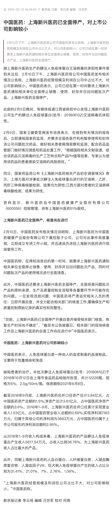
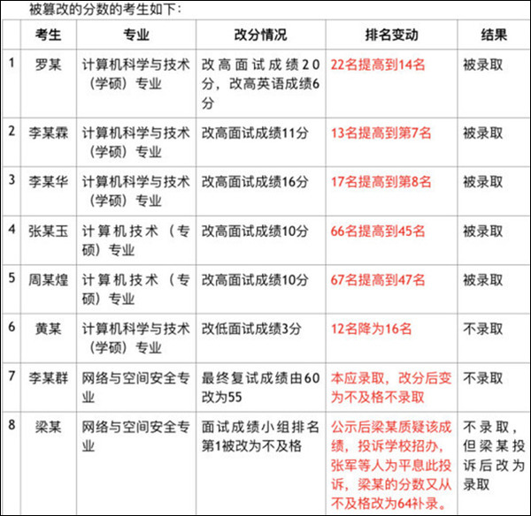
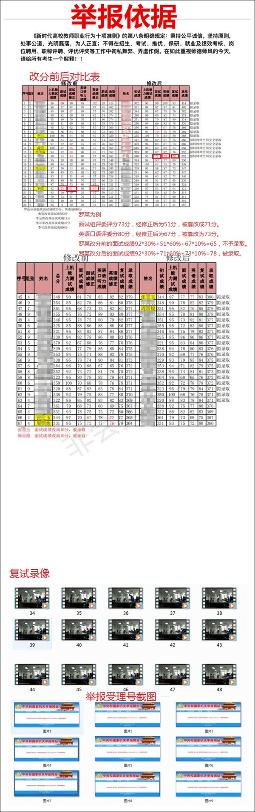
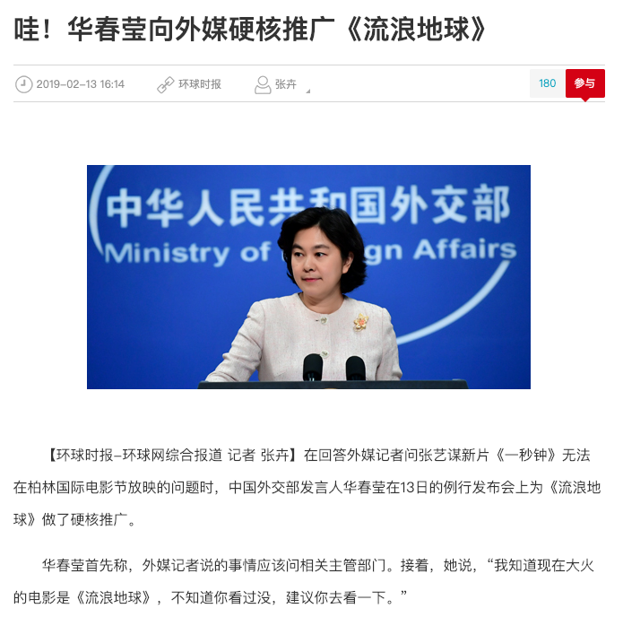

第七周 (02-10 ~ 02-16)
======

# [后续] 上海新兴医药全面停产

+ 时间

    2019-02-10
    
+ 来源

    新京报
    
    [http://www.bjnews.com.cn/finance/2019/02/10/545888.html](http://www.bjnews.com.cn/finance/2019/02/10/545888.html)
    
+ 截图

    
    
+ 前情提要

    [上海新兴静注人免疫球蛋白艾滋病抗体呈阳性](../06/README.md#上海新兴静注人免疫球蛋白艾滋病抗体呈阳性)

# 华南理工大学计算机工程学院篡改研究生复试成绩

+ 时间

    2019-02-11
    
+ 来源

    新浪微博：平凡的世界overlooker（已被封）
    
    [https://weibo.com/u/6895532648](https://weibo.com/u/6895532648)

+ 截图
    
    
    
    
    
    
    
    
    
    
    
    
    
    
    
    
    
    
    
    
    
    
    
    
    
    
    
+ 后续

    [\[后续\] 华南理工大学就计算机工程学院篡改研究生复试分数事件发表官方声明](#后续-华南理工大学就计算机工程学院篡改研究生复试分数事件发表官方声明)

    [\[后续\] 华南理工大学计算机工程学院篡改研究生复试成绩举报者微博账号被封](#后续-华南理工大学计算机工程学院篡改研究生复试成绩举报者微博账号被封)

# 电影《一秒钟》因技术原因无法在柏林电影节上映

+ 时间

    2019-02-11

+ 来源

    新浪微博：电影一秒钟
    
    [https://weibo.com/6691278817/HgbUqgrMa](https://weibo.com/6691278817/HgbUqgrMa)

+ 截图

    

+ 后续

    [\[后续\] 外交部发言人华春莹回答外媒记者张艺谋新片《一秒钟》无法在柏林国际电影节放映的问题时推广《流浪地球》](#后续-外交部发言人华春莹回答外媒记者张艺谋新片《一秒钟》无法在柏林国际电影节放映的问题时推广《流浪地球》)    

# [后续] 外交部发言人华春莹回答外媒记者张艺谋新片《一秒钟》无法在柏林国际电影节放映的问题时推广《流浪地球》

    这届外交部发言人意外的脑残

+ 时间

    2019-02-13
    
+ 来源

    环球网
    
    [http://world.huanqiu.com/exclusive/2019-02/14301539.html](http://world.huanqiu.com/exclusive/2019-02/14301539.html)
    
+ 截图

    

+ 前情提要

    [《流浪地球》上映](../06/README.md#《流浪地球》上映)

    [电影《一秒钟》因技术原因无法在柏林电影节上映](#电影《一秒钟》因技术原因无法在柏林电影节上映)

+ 后续

    [\[后续\] 《流浪地球》票房破 30 亿](#后续-《流浪地球》票房破-30-亿)

    [\[后续\] 《流浪地球》票房破 40 亿](../08/README.md#后续-《流浪地球》票房破-40-亿)

    [\[后续\] 中宣部办流浪地球研讨会 副国级领导与会](../08/README.md#后续-中宣部办流浪地球研讨会-副国级领导与会)

# [后续] 《流浪地球》票房破 30 亿

+ 时间

    2019-02-14
    
+ 来源

    新浪微博：电影流浪地球
    
    [https://weibo.com/6436669966/HgCmzqrEl](https://weibo.com/6436669966/HgCmzqrEl)

+ 截图

    

+ 前情提要

    [《流浪地球》上映](../06/README.md#《流浪地球》上映)

    [\[后续\] 外交部发言人华春莹回答外媒记者张艺谋新片《一秒钟》无法在柏林国际电影节放映的问题时推广《流浪地球》](#后续-外交部发言人华春莹回答外媒记者张艺谋新片《一秒钟》无法在柏林国际电影节放映的问题时推广《流浪地球》)

    [\[后续\] 《流浪地球》票房破 40 亿](../08/README.md#后续-《流浪地球》票房破-40-亿)

    [\[后续\] 中宣部办流浪地球研讨会 副国级领导与会](../08/README.md#后续-中宣部办流浪地球研讨会-副国级领导与会)

# [后续] 华南理工大学就计算机工程学院篡改研究生复试分数事件发表官方声明
    
+ 时间

    2019-02-14
    
+ 来源

    新浪微博：华南理工大学新闻中心
    
    [https://weibo.com/2372988170/HgFusBNKQ](https://weibo.com/2372988170/HgFusBNKQ)
    
+ 截图

    
    
+ 前情提要

    [华南理工大学计算机工程学院篡改研究生复试成绩](#华南理工大学计算机工程学院篡改研究生复试成绩)

+ 后续

    [\[后续\] 华南理工大学计算机工程学院篡改研究生复试成绩举报者微博账号被封](#后续-华南理工大学计算机工程学院篡改研究生复试成绩举报者微博账号被封)

# [后续] 华南理工大学计算机工程学院篡改研究生复试成绩举报者微博账号被封

+ 时间

    2019-02-15
    
+ 来源

    新浪微博：平凡的世界overlooker（已被封）
    
    [https://weibo.com/u/6895532648](https://weibo.com/u/6895532648)
    
+ 截图

    

+ 前情提要

    [华南理工大学计算机工程学院篡改研究生复试成绩](#华南理工大学计算机工程学院篡改研究生复试成绩)

    [\[后续\] 华南理工大学就计算机工程学院篡改研究生复试分数事件发表官方声明](#后续-华南理工大学就计算机工程学院篡改研究生复试分数事件发表官方声明)
