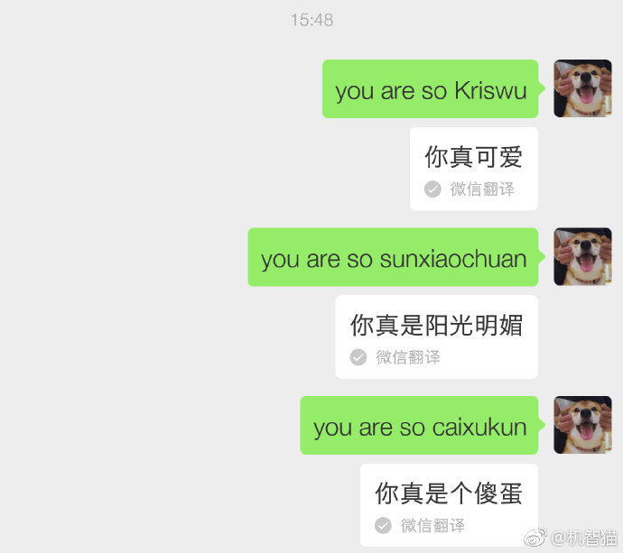
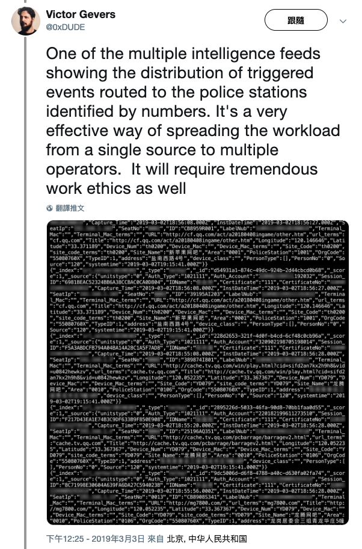
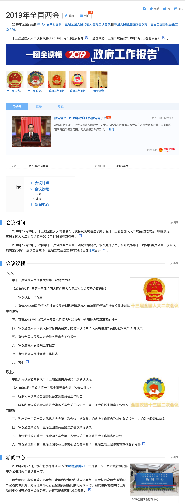
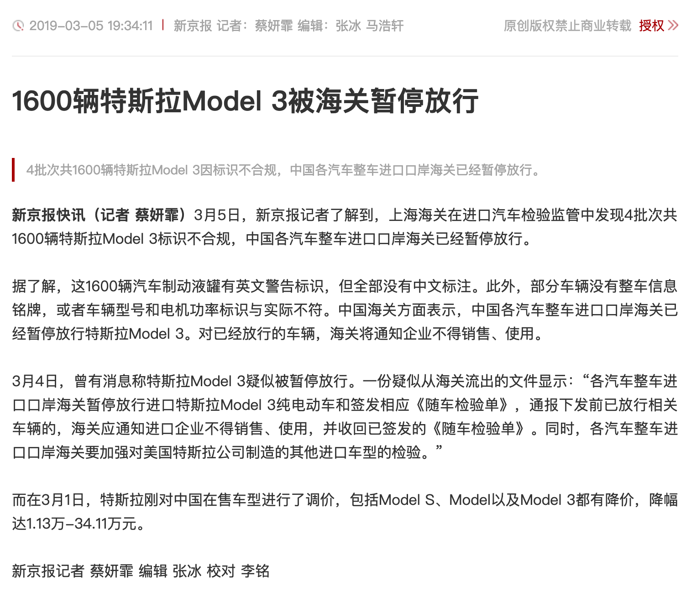
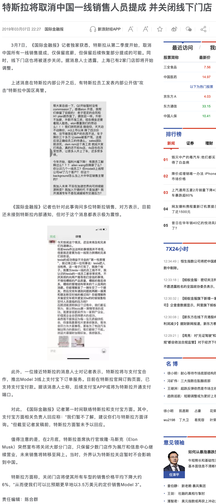
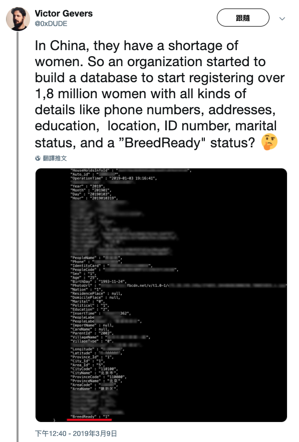

第十周 (03-03 ~ 03-09)
======

# you are so caixukun

+ 时间

    2019-03-03
    
+ 来源

    网络
    
+ 截图

    

# 外国安全人员发现国内聊天监控数据库存储的 3.64 亿条明文数据

    推特 ID：0xDUDE
    
+ 时间

    2019-03-03
    
+ 来源

    推特：0xDUDE
    
    [https://twitter.com/0xDUDE/status/1102303971765641216](https://twitter.com/0xDUDE/status/1102303971765641216)

+ 截图

    

    

+ 后续

    [\[后续\] 外国安全人员发现国内记录 1800 万育龄女性信息数据库](#后续-外国安全人员发现国内记录-1800-万育龄女性信息数据库)

# "两会"召开

+ 时间

    2019-03-03
    
+ 来源

    哪哪都是
    
    [https://baike.baidu.com/item/2019%E5%B9%B4%E5%85%A8%E5%9B%BD%E4%B8%A4%E4%BC%9A](https://baike.baidu.com/item/2019%E5%B9%B4%E5%85%A8%E5%9B%BD%E4%B8%A4%E4%BC%9A)
    
+ 截图

    

# [后续] 检方对河北涞源入室强奸未遂被反杀案当事人作出不起诉决定

+ 时间

    2019-03-03
    
+ 来源

    河北省保定市人民检察院
    
    [http://www.baoding.jcy.gov.cn/jcgg/201903/t20190303_2502139.shtml](http://www.baoding.jcy.gov.cn/jcgg/201903/t20190303_2502139.shtml)
    
    [http://www.baoding.jcy.gov.cn/jcgg/201903/t20190303_2502140.shtml](http://www.baoding.jcy.gov.cn/jcgg/201903/t20190303_2502140.shtml)
    
    [http://www.baoding.jcy.gov.cn/jcgg/201903/t20190303_2502141.shtml](http://www.baoding.jcy.gov.cn/jcgg/201903/t20190303_2502141.shtml)
    
+ 截图

    

    

    

+ 前情提要

    [追女大学生遭拒 河北涞源男子持械闯对方老家遭反杀](../03/README.md#追女大学生遭拒-河北涞源男子持械闯对方老家遭反杀)

# 褚时健去世

+ 时间

    2019-03-05
    
+ 来源

    新闻
    
    新浪微博：新京报
    
    [https://weibo.com/1644114654/HjvFG2VZ1](https://weibo.com/1644114654/HjvFG2VZ1)
    
+ 截图

    

# 1600 辆特斯拉 model 3 被海关暂停放行

+ 时间

    2019-03-05
    
+ 来源

    新闻
    
    新京报
    
    [http://www.bjnews.com.cn/auto/2019/03/05/553145.html](http://www.bjnews.com.cn/auto/2019/03/05/553145.html)
    
+ 截图

    

# 子弹短信团队解散

+ 时间

    2019-03-06
    
+ 来源

    36氪
    
    [https://36kr.com/p/5182755.html](https://36kr.com/p/5182755.html)
    
+ 截图

    

# 特斯拉宣布取消中国一线销售人员提成 并关闭线下门店

+ 时间

    2019-03-07
    
+ 来源

    新闻
    
    新浪财经
    
    [https://finance.sina.com.cn/chanjing/gsnews/2019-03-07/doc-ihsxncvh0700233.shtml](https://finance.sina.com.cn/chanjing/gsnews/2019-03-07/doc-ihsxncvh0700233.shtml)
    
+ 截图

    

# [后续] 外国安全人员发现国内记录 1800 万育龄女性信息数据库

+ 时间

    2019-03-09
    
+ 来源

    推特：0xDUDE
    
    [https://twitter.com/0xDUDE/status/1104482014202351616](https://twitter.com/0xDUDE/status/1104482014202351616)

+ 截图

    
    
+ 前情提要

    [外国安全人员发现国内聊天监控数据库存储的 3.64 亿条明文数据](#外国安全人员发现国内聊天监控数据库存储的-3.64-亿条明文数据)
