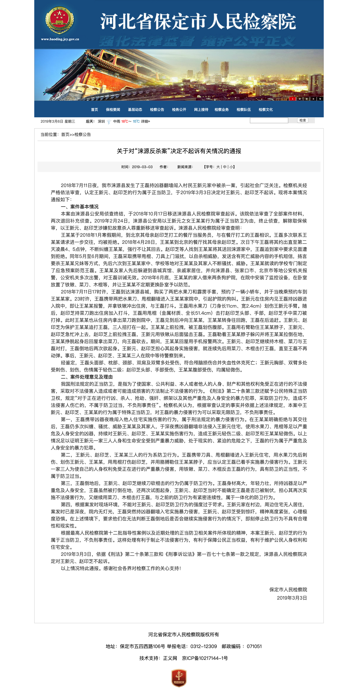
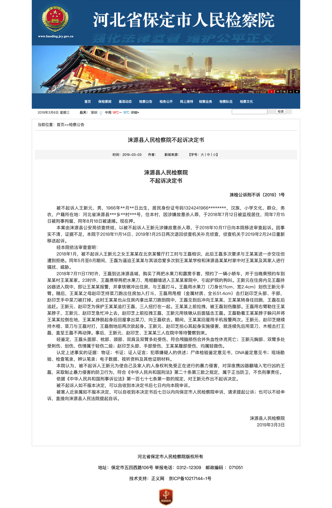
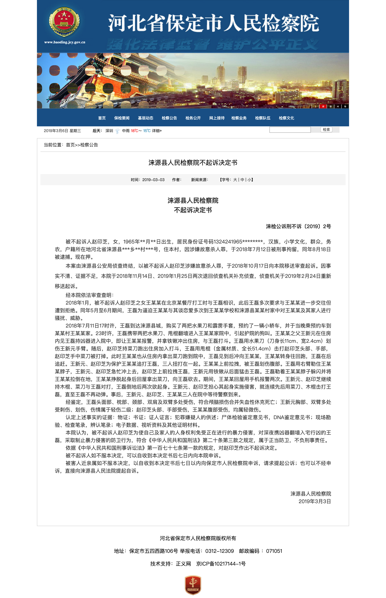

第十周 (03-03 ~ 03-09)
======

# [后续] 检方对河北涞源入室强奸未遂被反杀案当事人作出不起诉决定

+ 时间

    2019-03-03
    
+ 来源

    河北省保定市人民检察院
    
    [http://www.baoding.jcy.gov.cn/jcgg/201903/t20190303_2502139.shtml](http://www.baoding.jcy.gov.cn/jcgg/201903/t20190303_2502139.shtml)
    
    [http://www.baoding.jcy.gov.cn/jcgg/201903/t20190303_2502140.shtml](http://www.baoding.jcy.gov.cn/jcgg/201903/t20190303_2502140.shtml)
    
    [http://www.baoding.jcy.gov.cn/jcgg/201903/t20190303_2502141.shtml](http://www.baoding.jcy.gov.cn/jcgg/201903/t20190303_2502141.shtml)
    
+ 截图

    

    

    

+ 前情提要

    [追女大学生遭拒 河北涞源男子持械闯对方老家遭反杀](../03/README.md#追女大学生遭拒-河北涞源男子持械闯对方老家遭反杀)
