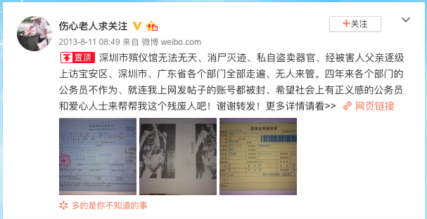
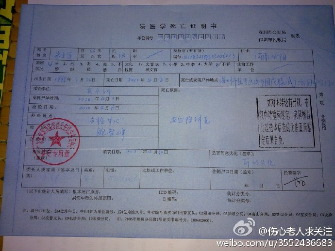
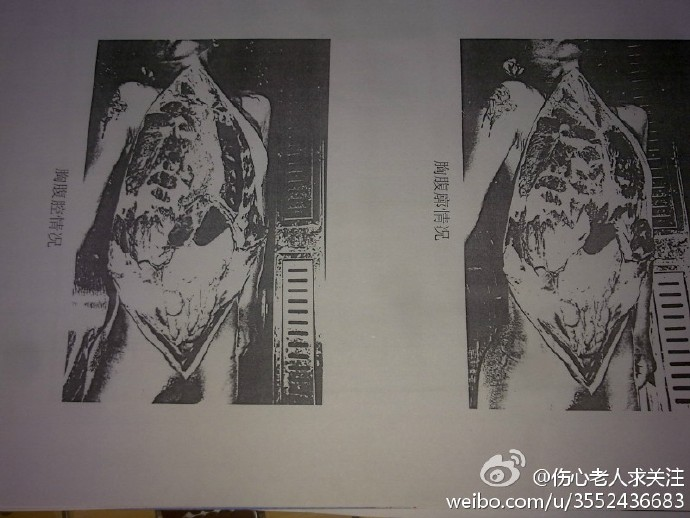
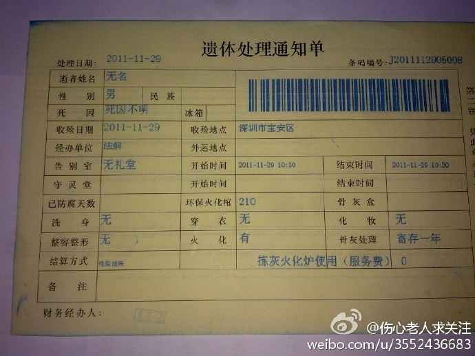
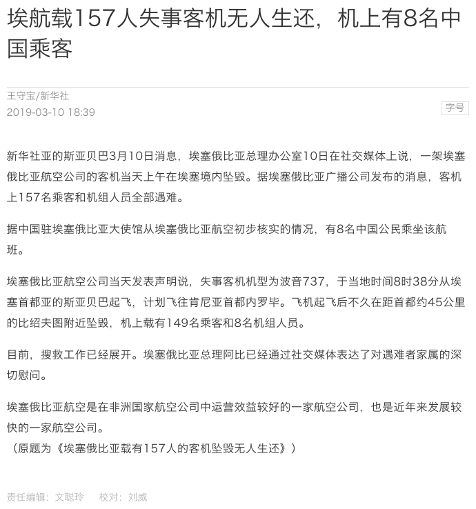
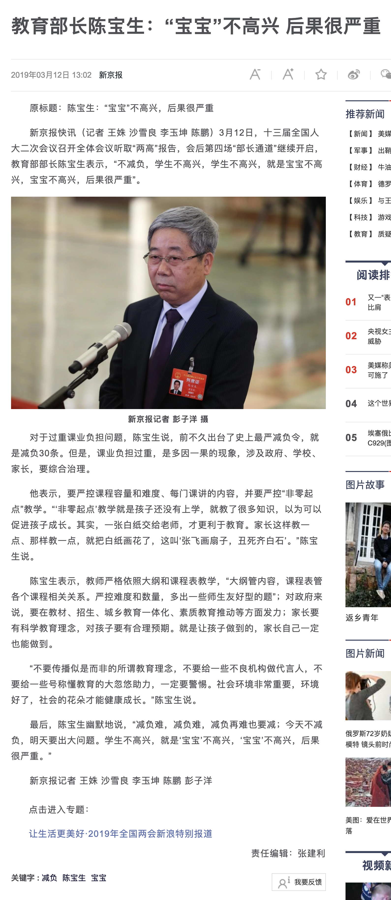

第十一周 (03-10 ~ 03-16)
======

# 深圳少年横死，公安局定为无名尸，索要尸体至今无果

+ 时间

    2010-03-29（案发时间）

    2019-03-10（热点时间）
    
+ 来源

    新浪微博：伤心老人求关注
    
    [https://weibo.com/3552436683/A4cYGtFQ1](https://weibo.com/3552436683/A4cYGtFQ1)
    
    天涯论坛
    
    [http://bbs.tianya.cn/post-no110-13448328-1.shtml](http://bbs.tianya.cn/post-no110-13448328-1.shtml)
    
+ 截图

    
    
    
    
    
    
    
    
    

# 埃航波音 737 max8 飞机坠毁

+ 时间

    2019-03-10
    
+ 来源

    澎湃新闻
    
    [https://www.thepaper.cn/newsDetail_forward_3110936](https://www.thepaper.cn/newsDetail_forward_3110936)
    
+ 截图

    
    
# 女子云南相亲欲离开遭阻挠 警察表示两人已是夫妻，需父母同意才可离开

+ 时间

    2019-03-11
    
+ 来源

    新浪微博：你孤独的醉意（已销号）
    
    观察者网（汇总）
    
    [https://www.guancha.cn/politics/2019_03_14_493560_s.shtml](https://www.guancha.cn/politics/2019_03_14_493560_s.shtml)
    
+ 截图
    
    
    
# 教育部长强行减负，记者采访表示"宝宝"不高兴，后果很严重

+ 时间

    2019-03-12
    
+ 来源

    新闻
    
    新浪新闻
    
    [https://news.sina.com.cn/gn/2019-03-12/detail-ihrfqzkc3238149.d.html](https://news.sina.com.cn/gn/2019-03-12/detail-ihrfqzkc3238149.d.html)
    
+ 截图

    
    