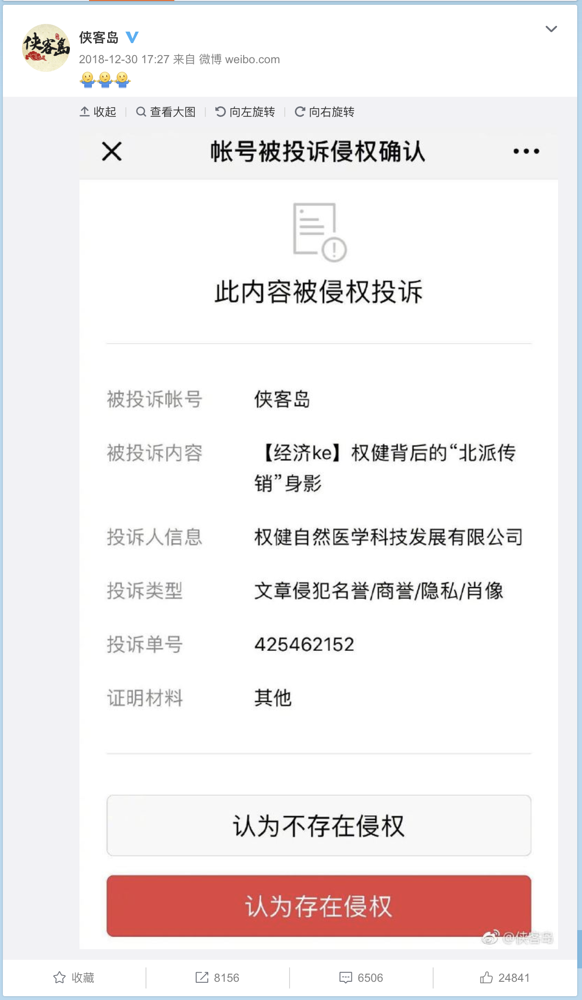
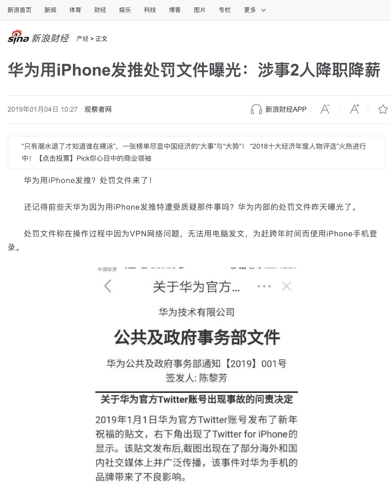
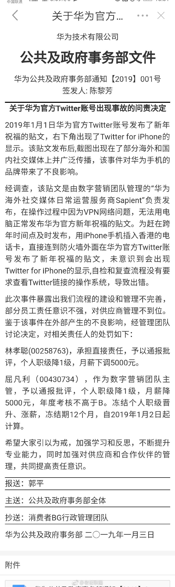
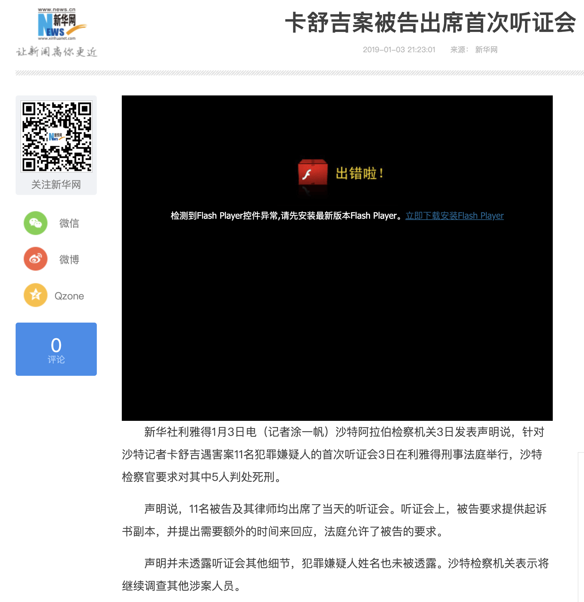
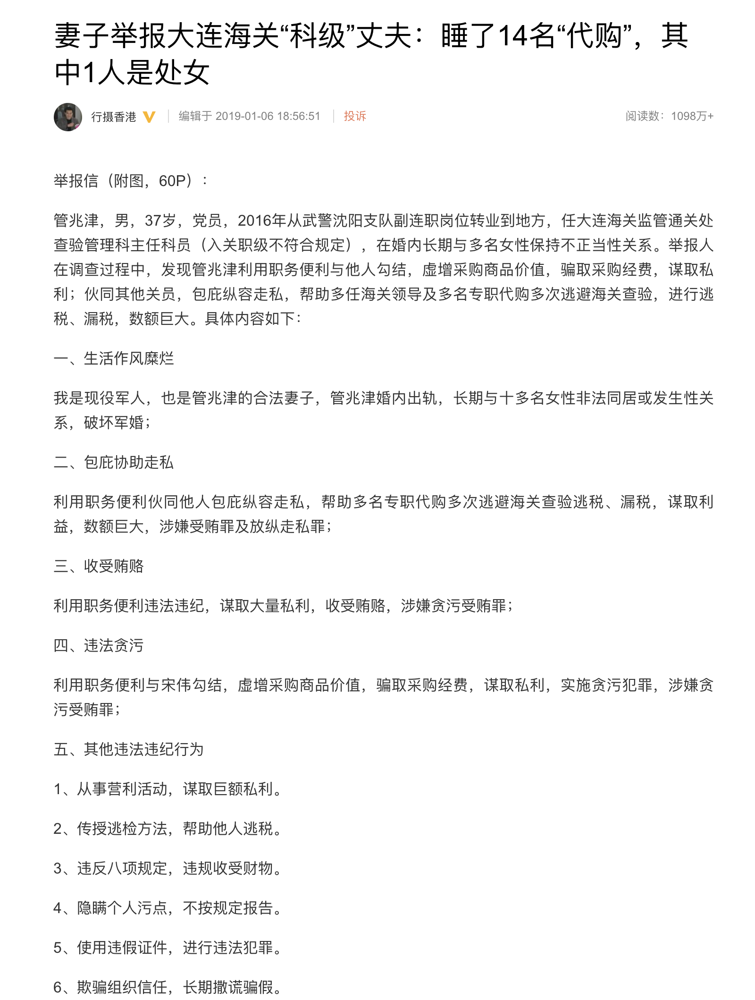
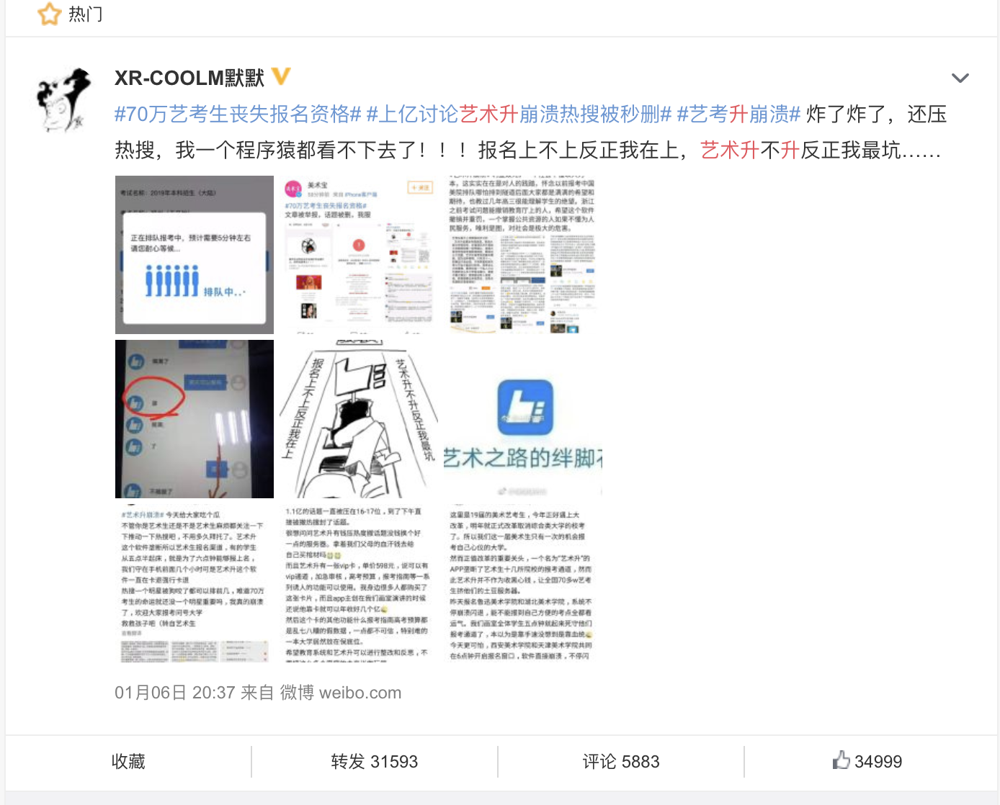
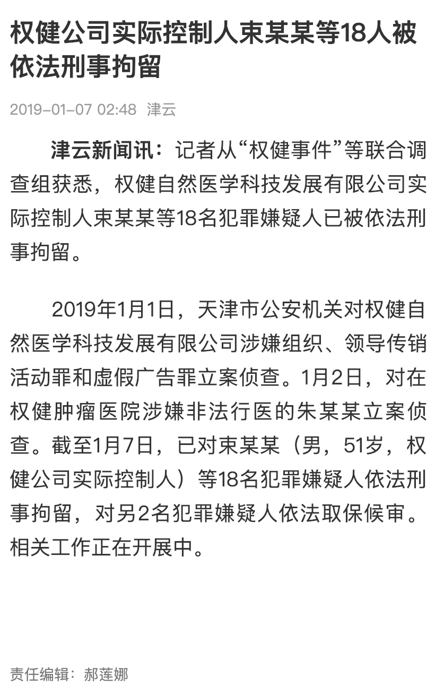

一月
====

# 税改引发房租涨价大讨论

+ 时间

    约 12 月中旬开始。
    
+ 来源

    网络讨论。

# 权健怒怼侠客岛

+ 时间

    2018-12-30 (“侠客岛” 发出微博时间)
    
+ 来源

    “侠客岛” 官方微博。
    
    [https://weibo.com/5476386628/H9DNmhK8J](https://weibo.com/5476386628/H9DNmhK8J)
    
+ 截图

    
    
+ 相关阅读
    
    紫光阁大饭店 __TODO__

+ 前情提要

    权健火疗耽误治疗至女童死亡 __TODO__
    
    其他相关新闻 __TODO__

    丁香医生发文声讨权健伪科学 __TODO__

# [后续] “BT 天堂”站长侵犯著作权被判三年

+ 时间

    2019-01-02
 
+ 来源

    “扫黄打非” 官方微信公众号。
    
    [https://mp.weixin.qq.com/s/SKISbSNbLQ1I5IJ_NfDQpw](https://mp.weixin.qq.com/s/SKISbSNbLQ1I5IJ_NfDQpw)

+ 截图

    

+ 前请提要

    __TODO__

# 《飞碟探索》杂志休刊一年

+ 时间
    
    2019-01-03 (最早新闻事件)
    
+ 来源

    __TODO__
    
+ 截图

    __TODO__

# [后续] 华为处理使用 iPhone 发推当事员工

+ 时间
    
    2019-01-03 (最早截图发布时间)
    
+ 来源

    网络 (未找到最早发布源)。

    来源之一：新浪新闻。
    
    [https://finance.sina.com.cn/chanjing/gsnews/2019-01-04/doc-ihqhqcis2970952.shtml](https://finance.sina.com.cn/chanjing/gsnews/2019-01-04/doc-ihqhqcis2970952.shtml)

+ 截图

    
    
    

+ 前请提要

    __TODO__

# [后续] 记者卡舒吉遇害案开庭

+ 时间

    2019-01-04 (新闻时间)
    
+ 来源

    新华网。
    
    [http://www.xinhuanet.com/world/2019-01/03/c_1210029802.htm](http://www.xinhuanet.com/world/2019-01/03/c_1210029802.htm)

+ 截图

    

# 妻子举报大连海关“科级”丈夫睡 14 名代购, 其中一名是处女

+ 时间

    2019-01-06 (微博文章发布时间)

+ 来源

    微博
    
    [https://www.weibo.com/ttarticle/p/show?id=2309404325189360998090](https://www.weibo.com/ttarticle/p/show?id=2309404325189360998090)

+ 截图

    

+ 官方回应

    __TODO__

# 外交官孙子举报其祖父与父亲

外交官孙子举报祖父与其亲生女儿乱伦、杀人，父亲乱搞男女关系，离婚后拒付抚养费。

+ 时间

    2019-01-06 (视频传播时间, 上传时间不可考)

+ 来源

    互联网 (来源已被删除)
    
    [https://www.youtube.com/watch?v=CS18-QCP20k](https://www.youtube.com/watch?v=CS18-QCP20k)

+ 视频 (墙内源已被删除)

    [https://www.youtube.com/watch?v=CS18-QCP20k](https://www.youtube.com/watch?v=CS18-QCP20k)

+ 当事人回应

    已报警 __TODO__

# “艺术升” APP 崩溃致 70 万艺考生无法报名

+ 时间

    2019-01-06 (报名时间早上 6:00)
    
+ 来源

    网络讨论, 关键词 “艺术升”
    
+ 截图

    微博热贴

    
    
+ 官方回应

    拉长报名三天 __TODO__

+ 相关阅读

    __99 宿舍网__
    
    李肇星之子李禾禾创办, 曾为大学英语四六级考试唯一成绩查询网站, 目前除主页外其他页面均已无法访问.

# [后续] 权健公司实际控制人束昱辉等18人被依法刑事拘留

+ 时间

    2019-01-07
    
+ 来源

    津云
    
    [http://www.app.tjyun.com/share/app/ve/app/newswebshare.html?newsId=036625688](http://www.app.tjyun.com/share/app/ve/app/newswebshare.html?newsId=036625688)

+ 截图

    
    
+ 前情提要

    请参阅 [权健怒怼侠客岛](https://github.com/Authenticat0r/Chronology-2019/blob/master/2019-01/README.md#%E6%9D%83%E5%81%A5%E6%80%92%E6%80%BC%E4%BE%A0%E5%AE%A2%E5%B2%9B) 有关章节
