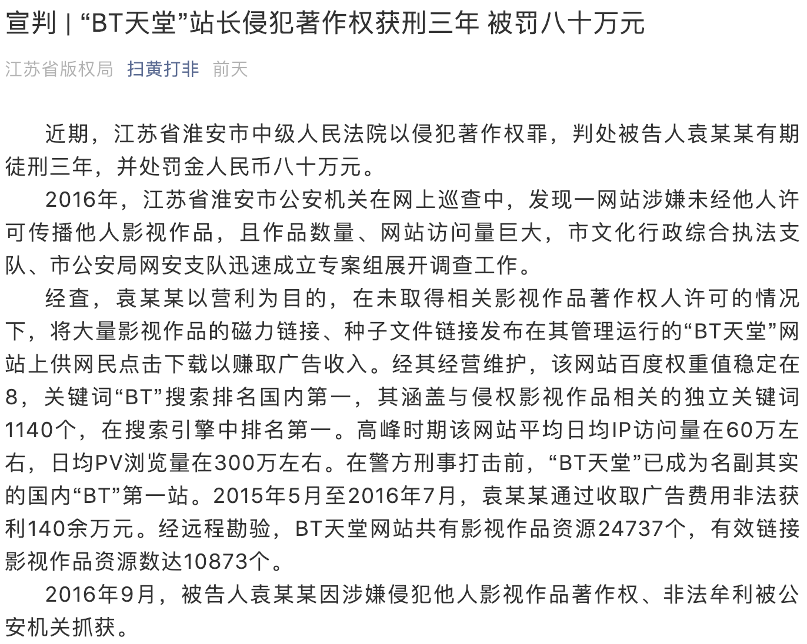

# 一月

## 权健怒怼侠客岛

## 华为处理使用 iPhone 发推当事员工

## “BT 天堂”站长侵犯著作权被判三年

+ 时间

    2019-01-02
 
+ 来源

    [https://mp.weixin.qq.com/s/SKISbSNbLQ1I5IJ_NfDQpw](https://mp.weixin.qq.com/s/SKISbSNbLQ1I5IJ_NfDQpw)

+ 截图

    

## [后续] 记者卡舒吉遇害案开庭

+ 时间

    2019-01-04 (新闻时间)
    
+ 来源

    [http://www.xinhuanet.com/world/2019-01/03/c_1210029802.htm](http://www.xinhuanet.com/world/2019-01/03/c_1210029802.htm)

+ 截图

    
